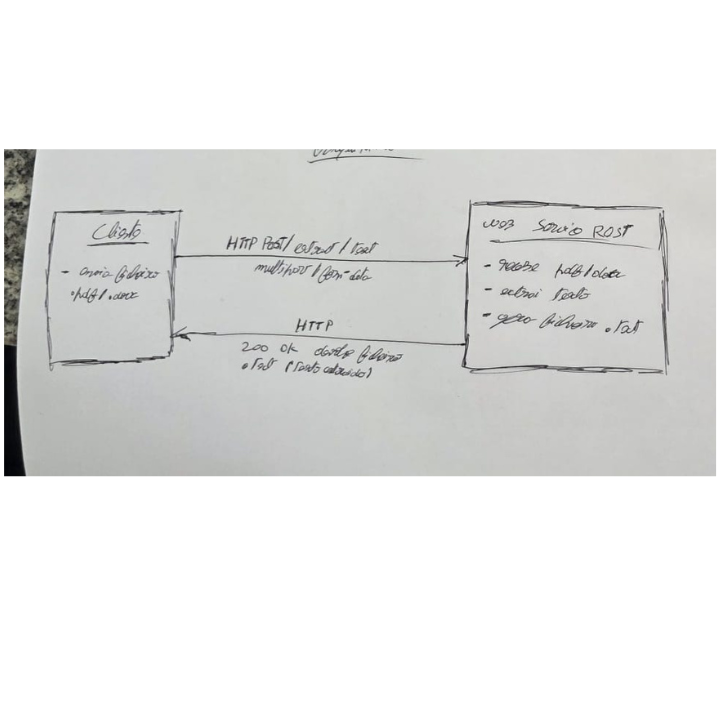
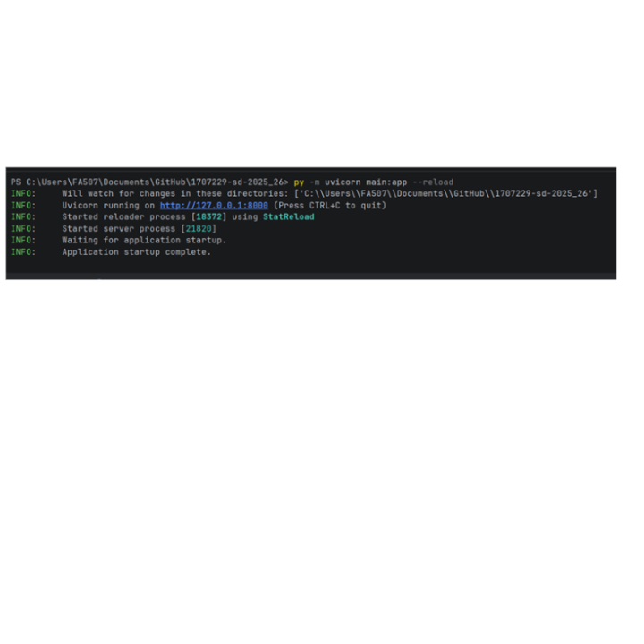
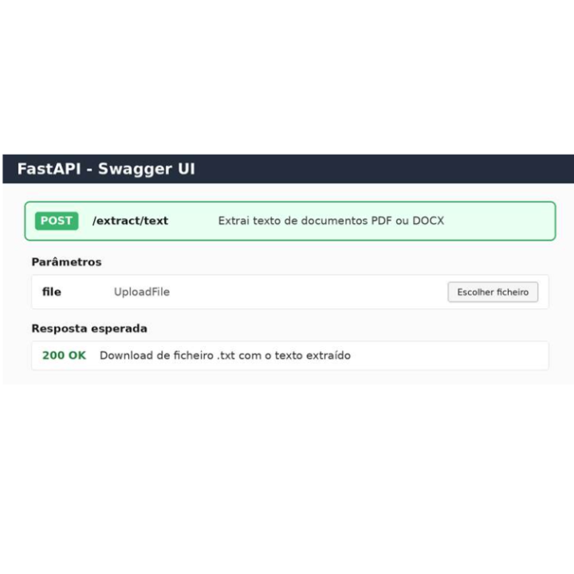

Relatório do Trabalho prático
Sistemas Distribuídos

Licenciatura em Engenharia Informática

ETD

Aluno: Diogo Silva, 1707229, 
       DiogoGH, diogorsilva04@gmail.com

1. Descrição do Trabalho	3
2. Implementação do Trabalho	3
3. Funcionamento do trabalho	3
4. Conclusão	3
Bibliografia	3

Descrição do Trabalho
O presente trabalho foi desenvolvido no âmbito da unidade curricular de Sistemas Distribuídos e consiste na criação de um web service REST capaz de receber documentos enviados por um cliente e devolver o respetivo conteúdo textual num ficheiro de texto simples. O serviço responde ao objetivo definido: permitir o upload de ficheiros PDF ou DOCX através de um pedido HTTP POST e devolver, em caso de sucesso, um ficheiro .txt com o texto extraído.
A solução implementada segue uma arquitetura cliente-servidor. O cliente realiza um pedido HTTP para o servidor, enviando o ficheiro através de multipart/form-data. O servidor valida o documento recebido, identifica o seu formato, executa a extração de texto com a biblioteca adequada e gera a resposta com o ficheiro .txt. Caso exista uma falha no pedido ou no processamento, o serviço devolve uma resposta de erro com código HTTP 400 ou 500.
1.1 Objetivos específicos
·        Criar um endpoint REST com o caminho POST /extract/text.
·        Permitir o envio de documentos nos formatos .pdf e .docx.
·        Validar se o ficheiro foi enviado, se não está vazio e se possui uma extensão permitida.
·        Extrair texto de ficheiros PDF e DOCX.
·        Devolver ao cliente um ficheiro .txt com o conteúdo textual extraído.
·        Tratar erros de validação e erros internos de processamento através de respostas HTTP adequadas.
1.2 Resumo do endpoint
Endpoint
POST /extract/text
Método HTTP
POST
Input
Ficheiro .pdf ou .docx enviado por multipart/form-data
Output
Ficheiro .txt com o texto extraído
Respostas
200 OK em caso de sucesso; 400/500 em caso de erro

 
1.3 Arquitetura da solução
A arquitetura da aplicação é composta por três momentos principais: receção do pedido, processamento do documento e devolução da resposta. O pedido parte do cliente e chega ao endpoint REST. A aplicação FastAPI verifica o ficheiro, escolhe o mecanismo de extração adequado e devolve o ficheiro .txt diretamente na resposta HTTP.

 

Implementação do Trabalho	
A implementação foi realizada em Python, recorrendo à framework FastAPI para a criação do serviço REST. Esta escolha permite criar endpoints de forma simples, validar ficheiros enviados pelo cliente e gerar automaticamente documentação interativa através do Swagger UI. A execução do servidor é feita com Uvicorn, que permite disponibilizar localmente a aplicação durante os testes.
O projeto foi mantido de forma simples, sendo composto pelos ficheiros essenciais main.py e requirements.txt. O primeiro contém toda a lógica do serviço, enquanto o segundo lista as bibliotecas necessárias para instalar e executar o projeto.
2.1 Estrutura do projeto
1707229-sd-2025_26/
 │
 ├── main.py
 └── requirements.txt

 
A estrutura utilizada facilita a entrega e a execução do trabalho, evitando ficheiros desnecessários. O ficheiro main.py concentra a criação da aplicação FastAPI, as funções de extração e o endpoint principal. O ficheiro requirements.txt permite instalar todas as dependências com um único comando.
2.2 Bibliotecas utilizadas
As bibliotecas utilizadas foram escolhidas de acordo com as necessidades do serviço. O FastAPI é responsável pela API REST, o Uvicorn executa o servidor, o python-multipart permite receber ficheiros em multipart/form-data, o pdfplumber extrai texto de ficheiros PDF e o python-docx permite ler o conteúdo textual de ficheiros DOCX.
fastapi
 uvicorn
 python-multipart
 pdfplumber
 python-docx

 
2.3 Criação da aplicação
A aplicação é criada através da classe FastAPI. Nesta fase são definidos o título, a descrição e a versão do serviço. Estes dados aparecem também na documentação automática, o que facilita os testes durante o desenvolvimento.
app = FastAPI(
     title="Web Service de Extração de Texto",
     description="Serviço REST para extração de texto de documentos PDF e DOCX.",
     version="1.0.0"
 )

 
2.4 Extração de texto de ficheiros PDF
Para ficheiros PDF foi utilizada a biblioteca pdfplumber. A função recebe o ficheiro em bytes, abre-o em memória e percorre todas as páginas do documento. Em cada página, é feita a tentativa de extração textual e, caso exista texto, este é acrescentado ao resultado final.
def extrair_texto_pdf(file_bytes: bytes) -> str:
     texto_extraido = ""

     with pdfplumber.open(io.BytesIO(file_bytes)) as pdf:
         for numero_pagina, pagina in enumerate(pdf.pages, start=1):
         	texto_pagina = pagina.extract_text()

         	if texto_pagina:
             	texto_extraido += f"\n--- Página {numero_pagina} ---\n"
             	texto_extraido += texto_pagina + "\n"

     return texto_extraido.strip()

 
Esta abordagem funciona corretamente em PDFs que contenham texto real. No entanto, se o PDF for composto apenas por imagens digitalizadas, poderá não existir texto extraível sem a utilização de OCR.
2.5 Extração de texto de ficheiros DOCX
Para ficheiros DOCX foi utilizada a biblioteca python-docx. A extração considera os parágrafos do documento e também o conteúdo existente em tabelas. No caso das tabelas, os valores de cada linha são separados por barras verticais, permitindo que a informação continue legível no ficheiro de texto final.
def extrair_texto_docx(file_bytes: bytes) -> str:
     texto_extraido = ""
     documento = Document(io.BytesIO(file_bytes))

     for paragrafo in documento.paragraphs:
         if paragrafo.text.strip():
         	texto_extraido += paragrafo.text + "\n"

     for tabela in documento.tables:
         for linha in tabela.rows:
         	valores_linha = []
         	for celula in linha.cells:
                 valores_linha.append(celula.text.strip())
         	texto_extraido += " | ".join(valores_linha) + "\n"

     return texto_extraido.strip()

 
2.6 Endpoint POST /extract/text
O endpoint principal recebe um ficheiro através do parâmetro file. O ficheiro é validado antes do processamento. Primeiro verifica-se se foi enviado algum ficheiro, depois é obtida a extensão e confirmada a sua validade. Em seguida, o conteúdo é lido em bytes e enviado para a função de extração correspondente ao tipo de documento.
@app.post("/extract/text")
 async def extract_text(file: UploadFile = File(...)):
     if not file.filename:
         raise HTTPException(status_code=400, detail="Nenhum ficheiro foi enviado.")

     nome_ficheiro = file.filename
     extensao = os.path.splitext(nome_ficheiro)[1].lower()

     if extensao not in [".pdf", ".docx"]:
         raise HTTPException(
         	status_code=400,
         	detail="Formato inválido. Apenas são permitidos ficheiros PDF ou DOCX."
         )

 
O tratamento de exceções distingue erros de validação, que originam respostas HTTP 400, de falhas internas durante a leitura ou extração, que originam respostas HTTP 500. Esta separação permite ao cliente perceber se o problema está no pedido enviado ou no processamento interno do serviço.
2.7 Devolução do ficheiro TXT
Depois de o texto ser extraído, o serviço cria uma resposta do tipo text/plain e define o cabeçalho Content-Disposition para que o resultado seja tratado como um ficheiro de download. Assim, o cliente recebe um ficheiro .txt com o mesmo nome base do documento original.
return Response(
     content=texto,
     media_type="text/plain; charset=utf-8",
     headers={
         "Content-Disposition": f'attachment; filename="{nome_txt}"'
     }
 )

 

 

Funcionamento do trabalho	
Para executar o projeto, é necessário instalar previamente as dependências presentes no ficheiro requirements.txt. Após a instalação, o servidor pode ser iniciado com o comando py -m uvicorn main:app --reload. O parâmetro --reload permite reiniciar automaticamente a aplicação sempre que o código é alterado durante o desenvolvimento.
3.1 Instalação das dependências
py -m pip install -r requirements.txt

 
3.2 Execução do servidor
py -m uvicorn main:app --reload

 
Quando o servidor arranca corretamente, o terminal indica que a aplicação está disponível em http://127.0.0.1:8000. Esta mensagem confirma que o serviço se encontra ativo e pronto a receber pedidos HTTP.

3.3 Teste através da documentação automática
A documentação automática do FastAPI pode ser acedida através do endereço /docs. Nessa página é possível selecionar o endpoint POST /extract/text, carregar em Try it out, escolher um ficheiro PDF ou DOCX e executar o pedido. Em caso de sucesso, o serviço devolve o ficheiro .txt com o conteúdo extraído.

3.4 Resultado esperado
Quando é enviado um ficheiro válido, o serviço devolve uma resposta HTTP 200 OK. O corpo da resposta corresponde ao texto extraído e é enviado com o tipo text/plain. Como o cabeçalho Content-Disposition está definido como attachment, o resultado pode ser descarregado como ficheiro .txt.
Exemplo de resultado:

 --- Página 1 ---
 Texto extraído do documento enviado pelo cliente.

 
3.5 Situações de erro previstas
O serviço também prevê situações de erro. Se nenhum ficheiro for enviado, se o ficheiro estiver vazio ou se o formato não for suportado, é devolvida uma resposta HTTP 400. Se ocorrer uma falha interna durante a leitura do documento, é devolvida uma resposta HTTP 500. Esta lógica torna o serviço mais robusto e mais adequado a um cenário real de comunicação cliente-servidor.
·        400 Bad Request: nenhum ficheiro enviado.
·        400 Bad Request: ficheiro vazio.
·        400 Bad Request: formato diferente de .pdf ou .docx.
·        400 Bad Request: documento sem texto extraível.
·        500 Internal Server Error: falha inesperada durante o processamento.

 

Conclusão
Com este trabalho foi desenvolvido um web service REST funcional para extração de texto de documentos. A aplicação permite que um cliente envie ficheiros PDF ou DOCX através do endpoint POST /extract/text e receba como resposta um ficheiro .txt com o conteúdo textual extraído. A solução cumpre os requisitos principais definidos no enunciado, incluindo a utilização de HTTP POST, o envio através de multipart/form-data, a devolução de ficheiro .txt e o tratamento de erros com respostas HTTP adequadas.
A implementação permitiu aplicar conceitos importantes de Sistemas Distribuídos, nomeadamente a comunicação cliente-servidor, a disponibilização de serviços através de endpoints REST, o processamento de pedidos HTTP e a construção de respostas normalizadas. A utilização do FastAPI simplificou a criação da API e disponibilizou documentação automática, facilitando os testes e a validação do funcionamento.
Como trabalho futuro, seria possível melhorar o serviço com suporte a OCR para PDFs digitalizados, autenticação de utilizadores, limitação do tamanho máximo dos ficheiros, registo de logs e armazenamento temporário controlado dos documentos processados. Apesar dessas possíveis melhorias, a versão atual apresenta uma implementação simples, objetiva e adequada ao objetivo proposto.

Bibliografia
[1] FastAPI. Documentação oficial da framework FastAPI. Disponível em: https://fastapi.tiangolo.com/
[2] Uvicorn. Documentação oficial do servidor ASGI Uvicorn. Disponível em: https://www.uvicorn.org/
[3] pdfplumber. Biblioteca Python para extração de texto e informação de ficheiros PDF. Disponível em: https://github.com/jsvine/pdfplumber
[4] python-docx. Documentação da biblioteca para leitura e criação de documentos DOCX. Disponível em: https://python-docx.readthedocs.io/
[5] Python Software Foundation. Documentação oficial da linguagem Python. Disponível em: https://docs.python.org/3/

